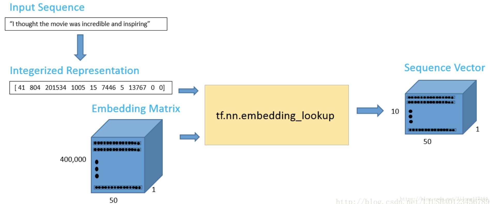
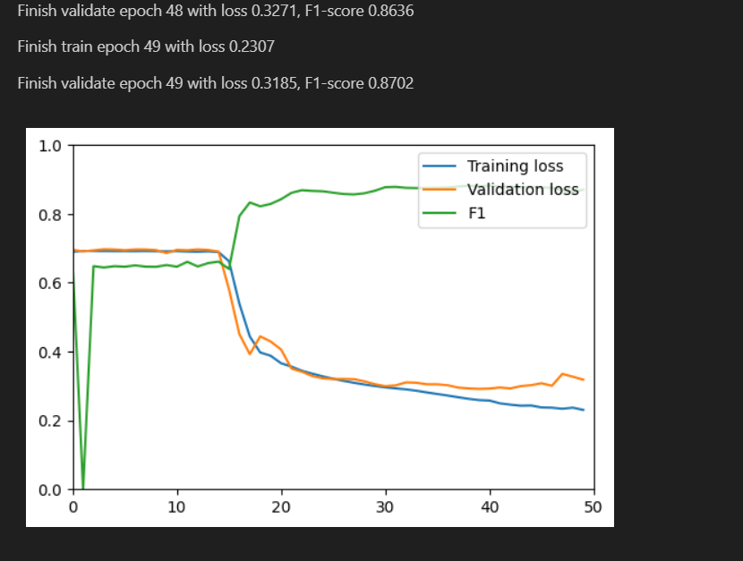
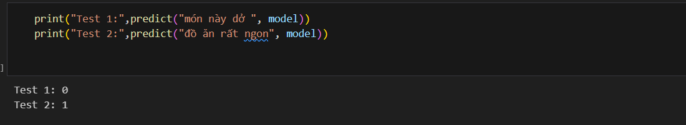

# Sentiment-Analysis-with-FoodyComment
トレーニング用のデータセットは食品レビュー Web サイト: https://www.foody.vn 

褒め言葉と批判の2種類付き。 モデルは LSTM を使用してコメントが肯定的か否定的かを予測しました.

##  Data Processing
インデックス行列と単語埋め込みをトレーニング用のデータ テンソルに結合するプロセスは、以下に示すように説明されます。

## Model 
この演習で使用する LSTM ネットワーク アーキテクチャについては、以下で説明します。
モデルの複雑さを増すために、LSTM レイヤーをオーバーラップします (スタックされた LSTM レイヤー)。
下位 LSTM 層と上位 LSTM 層の間に、ドロップアウト層を配置します。

# Training
F1スコア結果は約87％。

# Predict

